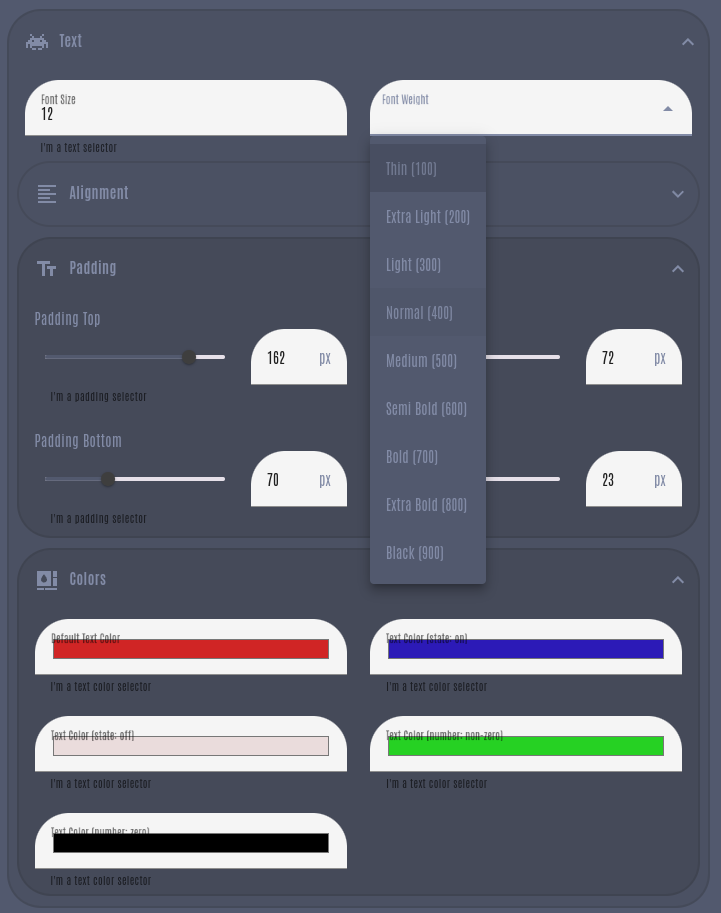

<p align="left">
  
  
  
<p>


# Card Editor Form Builder for Home Assistant

An reimplementation of the original [`ha-editor-formbuilder (by marcokreeft87)`](https://github.com/marcokreeft87/ha-editor-formbuilder) - with a focus on supporting extensive YAML configurations, controls backed by `ha-selector`, conditional expresssion evaluation, and more.

<br>
<div class="carousel">
  <div class="carousel-inner">
    
    
    
    
    
    
    
    
  </div>
</div>

<style>
.carousel {
  width: 700px;
  height: 550px;
  overflow: hidden;
  position: relative;
}

.carousel-inner {
  display: flex;
  width: 650%;
  animation: slide 25s infinite linear;
}

.carousel-inner img {
  width: 12.5%;
  height: 100%;
  object-fit: cover;
}

@keyframes slide {
  0% { transform: translateX(0%); }
  100% { transform: translateX(-50%); }

}
</style>

<br>

- [Card Editor Form Builder for Home Assistant](#card-editor-form-builder-for-home-assistant)
  - [Overview](#overview)
- [Usage](#usage)
  - [Installation](#installation)
  - [Basic Configuration](#basic-configuration)
    - [Extending and Implementing the Editor Class](#extending-and-implementing-the-editor-class)
  - [Form Configuration Structure](#form-configuration-structure)
    - [YAML Structure](#yaml-structure)
    - [Rows](#rows)
    - [Sections \[`ha-expansion-panel`\]](#sections-ha-expansion-panel)
      - [Section Type Options](#section-type-options)
    - [Control Rows](#control-rows)
      - [ControlRow Type Options](#controlrow-type-options)
    - [Controls](#controls)
      - [Control Types](#control-types)
      - [Control - Common Options](#control---common-options)
  - [Conditions](#conditions)
    - [Condition Types](#condition-types)
    - [Examples](#examples)
      - [visibilityCondition](#visibilitycondition)
      - [disabledCondition](#disabledcondition)
      - [optionsCondition \[Dynamic Options list for `selector: select`\]](#optionscondition-dynamic-options-list-for-selector-select)
  - [Examples](#examples-1)
  - [`ha-selector` Control Reference](#ha-selector-control-reference)
    - [Common Parameters](#common-parameters)
    - [Selectors](#selectors)
      - [String/Text Selector \[`type: text`\]](#stringtext-selector-type-text)
      - [Boolean Selector \[`type: boolean`\]](#boolean-selector-type-boolean)
      - [Number Selector \[`type: number`\]](#number-selector-type-number)
      - [Entity Selector \[`type: entity`\]](#entity-selector-type-entity)
        - [Entity Selector Filter](#entity-selector-filter)
      - [Icon Selector \[`type: icon`\]](#icon-selector-type-icon)
      - [Select Selector \[`type: select`\]](#select-selector-type-select)
        - [Select Option](#select-option)
      - [UI Action Selector \[`type: ui_action`\]](#ui-action-selector-type-ui_action)
      - [UI Color Selector \[`type: ui_color`\]](#ui-color-selector-type-ui_color)
      - [Color Temp Selector \[`type: color_temp`  \]](#color-temp-selector-type-color_temp--)
      - [QR Code Selector \[`type: qr_code`\]](#qr-code-selector-type-qr_code)

## Overview

This form builder can be integrated into your custom card projects, allowing you to easily create dynamic and interactive forms for your custom card's editor. By leveraging the standard Home Assistant selector controls and dynamic expressions, you can build a clean, adaptable, and user-friendly interface for configuring your cards.

# Usage

## Installation

To use the Card Editor Form Builder, first install the module into your project:

```shell
npm install 'ha-card-formbuilder@git+https://github.com/snootched/ha-card-formbuilder' --save
```

## Basic Configuration

You will import the `Editor` class into your project and extend it for use.

You can define your form configurations within your code if preferred, but importing from a YAML file provides quick edit capabilities and is the primary use-case.

### Extending and Implementing the Editor Class

To extend and implement the Editor class:

1. **Import the Editor Class**: Import the base Editor class from the module.

2. **Extend the Editor Class**: Create a new class that extends the base Editor class.

3. **Implement Required Methods**: Implement the required methods such as `render`.

4. **Load Configuration for Rendering**: Load your form configuration (from YAML or js variable) and call the `generateForm(formContent)` method from `render()`

Here is an example of how to extend and implement the Editor class:

```javascript
import { Editor } from 'path-to-editor-module';
import { html } from 'lit';

class CustomCardEditor extends Editor {

    _formControls;

    constructor(cardType) {
        super();

        // load the configuration from your yaml file with your preferred method of doing so
        this._formControls = {};
        this._formControls = myYamlLoader('myYamlFile');
    }

    render() {
        if (!this._hass) {
            return html`<ha-alert alert-type="error" title="Error">Home Assistant instance is missing.</ha-alert>`;
        }

        if (!this._config) {
            return html`<ha-alert alert-type="error" title="Error">Card configuration is missing.</ha-alert>`;
        }

        if (!this._formControls) {
            return html`<ha-alert alert-type="error" title="Error">Form controls are missing.</ha-alert>`;
        }

        try {
            const formContent = this._formControls;
            const returnForm = this.generateForm(formContent);
            return returnForm;
        } catch (error) {
            console.error('Error rendering configuration form:', error);
            return html`<ha-alert alert-type="error" title="Error">Error rendering form: ${error.message}</ha-alert>`;
        }
    }
}

customElements.define('custom-card-editor', CustomCardEditor);
```


## Form Configuration Structure

The form configuration is structured in a hierarchical manner using sections, rows, and controls. Each level of the hierarchy has specific properties and types that define the form's layout and behavior.
If you have multiple cards to build editors for, you can create an array within your file to do so.


### YAML Structure
```
+----------------+
|  you-card-#    |
+----------------+
    |
    +-- render_form
    |      |
    |      +-- Section
    |      |      |
    |      |      +-- label
    |      |      +-- outlined
    |      |      +-- icon
    |      |      +-- rows
    |      |             |
    |      |             +-- ControlRow
    |      |             |      |
    |      |             |      +-- cssClass
    |      |             |      +-- visibilityCondition
    |      |             |      +-- controls
    |      |             |             |
    |      |             |             +-- Control
    |      |             |             |      |
    |      |             |             |      +-- label
    |      |             |             |      +-- helper
    |      |             |             |      +-- configValue
    |      |             |             |      +-- type
    |      |             |             |      +-- selector
    |      |             |             |             |
    |      |             |             |             +-- select
    |      |             |             |                     |
    |      |             |             |                    +-- options
    |      |             |             +-- Control                 |
    |      |             |                                         +-- value
    |      |             |                                         +-- label
    |      |             |
    |      |             +-- ControlRow
    |      |                    |
    |      |                    +-- cssClass
    |      |                    +-- controls
    |      |                           |
    |      |                           +-- Control
    |      |                                  |
    |      |                                  +-- label
    |      |                                  +-- helper
    |      |                                  +-- configValue
    |      |                                  +-- type
    |      |                                  +-- selector
    |      |                                         |
    |      |                                         +-- select
    |      |                                                |
    |      |                                                +-- optionsCondition
    |
    +-- css
            |
            +-- cssText
```
### Rows
A row is a container within a section that holds one or more control rows or sections. Rows can have properties such as `visibilityCondition` and `cssClass`.

```yaml
rows:
  - type: ControlRow
    cssClass: "my-custom-css-class-in-cssText"
    controls:
      - ....control
      - ....control
  - type: ControlRow
    cssClass: "form-row two-controls"
    controls:
      - ....control
      - ....control
  - type: Section
    rows:
      - type: ControlRow
      .
      .

```
### Sections [`ha-expansion-panel`]
A section is a top-level container that groups related rows and controls. It uses `ha-expansion-panel` and has properties such as `label`, `outlined`, `icon`, and more.

Tip: Sections can also be nested to form groupings of similar control items into larger control groups.

```yaml
- type: Section
  label: "Section Label"
  outlined: true
  leftChevron: false
  headerLevel: 4
  icon: "mdi:icon-name"
  noCollapse: false
  rows: # Array of rows within the section
    - type: ControlRow
      cssClass: "form-row"
      controls: # Array of controls within the row
        - label: "Control Label"
          helper: "Helper text"
          configValue: "config.path"
          type: Selector
          selector:
            select:
              options:
                - value: "option1"
                  label: "Option 1"
                - value: "option2"
                  label: "Option 2"
```

#### Section Type Options

| Parameter             | Description                                                                 | Type    | Options | Required | Default Value |
|-----------------------|-----------------------------------------------------------------------------|---------|---------|----------|---------------|
| `type`                | The type of the element                                                     | String  | `Section`| Yes      | -             |
| `label`               | The label for the section                                                   | String  | -       | No       | -             |
| `outlined`            | Whether the section is outlined                                             | Boolean | -       | No       | true         |
| `leftChevron`         | Whether to show a left chevron                                              | Boolean | -       | No       | false         |
| `headerLevel`         | The header level for the section                                            | Number  | 1-6     | No       | 4             |
| `icon`                | The icon for the section                                                    | String  | -       | No       | -             |
| `noCollapse`          | Whether the section is collapsible                                          | Boolean | -       | No       | false         |
| `visibilityCondition` | Condition to determine if the section is visible                            | String  | -       | No       | -             |
| `rows`                | Array of rows (`Sections` or `ControlRows`)                                  | Array   | -       | Yes      | -             |                            | Array  | -       | Yes       |


### Control Rows

Control Rows are the rows in the form (or within Sections) that the controls are placed.

#### ControlRow Type Options

| Parameter   | Description                                      | Type    | Options | Required |
|-------------|--------------------------------------------------|---------|---------|----------|
| `type`      | The type of the element                          | String  | `ControlRow` | Yes      |
| `cssClass`  | CSS class to apply to the row                    | String  | -       | No       |
| `visibilityCondition` | Condition to determine if the section is visible                            | String  | -       | No       |
| `controls`  | Array of controls within the row                 | Array   | -       | Yes      |


### Controls
Controls are the individual form elements within a row. Each control can have various properties such as `label`, `helper`, `configValue`, `type`, and more. The `type` property determines the specific control type.

#### Control Types

The following control types are supported:

- **`Selector`**: A dropdown or radio button selector.
- **`Divider`**: A horizontal divider.
- **`Filler`**: An empty filler control.
- **`Message`**: An alert/message control [`ha-alert`]
- **`RawHTML`**: Render a raw HTML string.

```yaml
- type: Selector
  label: "Control Label"
  helper: "Helper text"
  configValue: "path.to.config.option"
  selector:
    select:
      options:
        - value: "option1"
          label: "Option 1"
        - value: "option2"
          label: "Option 2"
```


#### Control - Common Options

| Parameter     | Description                                                                 | Type    | Options | Default Value | Required |
|---------------|-----------------------------------------------------------------------------|---------|---------|---------------|----------|
| `type`        | The control type                                                            | String  |`Selector`<br>`Divider`<br>`Filler`<br>`Message`<br>`RawHTML` |-     | Yes      |
| `configValue` | The configuration value path the control is for.                                         | String  | -       | -             | Yes      |
| `label`       | The label for the control                                                   | String  | -       | -             | No       |
| `helper`      | Helper text for the control                                                 | String  | -       | -             | No       |
| `disabled`    | Whether the control is disabled                                             | Boolean | -       | `false`       | No       |
| `required`    | Whether the control is required                                             | Boolean | -       | `false`       | No       |
| `selector`    | The specific selector definition (see below)                                            | Object  | -        | -             | Yes (`type: Selector`)     |
| `visibilityCondition`,`disabledCondition`    | Conditional expressions (see below)                                            | String  | -             | -      | No


## Conditions

The `visibilityCondition` and `disabledCondition` options allow you to dynamically control the visibility and enabled state of controls based on specific conditions. These conditions are evaluated as JavaScript expressions within the context of the form.
You have access to the context including `this`, `hass`, and `window`.

### Condition Types

| Parameter            | Description                                                                 | Type    | Required |
|----------------------|-----------------------------------------------------------------------------|---------|----------|
| `visibilityCondition`| Condition to determine if the control is visible                            | String  | No       |
| `disabledCondition`  | Condition to determine if the control is disabled                           | String  | No       |

### Examples

#### visibilityCondition

The `visibilityCondition` option can be used to show or hide a control based on a specific condition. For example, you can show a control only if a certain configuration value is true.

```yaml
- type: ControlRow
  cssClass: "form-row"
  controls:
    - label: "Show Icon"
      helper: "Toggle to show or hide the icon"
      configValue: "show_icon"
      type: Switch
      visibilityCondition: "this._config.someCondition === true"
```
In this example, the "Show Icon" control will only be visible if `someCondition` is true.


#### disabledCondition

The `disabledCondition` option can be used to enable or disable a control based on a specific condition. For example, you can disable a control if a certain configuration value is false.

```yaml
- type: ControlRow
  cssClass: "form-row"
  controls:
    - label: "Background Color"
      helper: "Select the background color"
      configValue: "background_color"
      type: Selector
      selector:
        select:
          options:
            - value: "red"
              label: "Red"
            - value: "blue"
              label: "Blue"
      disabledCondition: "this._config.someOtherCondition === false"
```
In this example, the "Background Color" control will be disabled if `someOtherCondition` is false.

#### optionsCondition [Dynamic Options list for `selector: select`]

You can dynamically generate options arrays for the `select` selector based on expressions. For example with access to our context, you can list CSS variables that start with a specific prefix.

```yaml
- controls:
    - label: "Options from Vars"
      configValue: "cblcars_card_config.variables.card.background.color.default"
      type: Selector
      selector:
        select:
          optionsCondition: |
            (() => {
              const styles = document.documentElement.style;
              const options = [];
              for (let i = 0; i < styles.length; i++) {
                const name = styles[i];
                if (name.startsWith('--picard-')) {
                  const value = styles.getPropertyValue(name).trim();
                  options.push({ value, label: name.replace('--', '') });
                }
              }
              return options;
            })()
```


## Examples
Basic Example
Here is a basic example of a form configuration:

```yaml
my-card:
  render_form:
    - type: Section
      label: "Section 31"
      outlined: true
      leftChevron: false
      headerLevel: 4
      icon: "mdi:space-invaders"
      noCollapse: false
      rows:
        - type: ControlRow
          cssClass: "form-row two-controls"
          controls:
            - label: "Label (text)"
              helper: "I'm a text selector"
              configValue: "configSample.textSelector.typeText"
              disabled: false
              required: true
              type: Selector
              selector:
                text:
            - label: "Label (color)"
              helper: "I'm a text color selector"
              configValue: "configSample.textSelector.typeColor"
              disabled: false
              required: true
              type: Selector
              selector:
                color:
```


```yaml
my-card:
  render_form:
    - type: Section
      label: "General Settings"
      outlined: true
      icon: "mdi:settings"
      rows:
        - type: ControlRow
          cssClass: "form-row two-controls"
          controls:
            - label: "Entity"
              helper: "Select the entity"
              configValue: "entity"
              type: Selector
              selector:
                entity:
            - label: "Show Icon"
              helper: "Toggle to show or hide the icon"
              configValue: "show_icon"
              type: Switch
        - type: ControlRow
          cssClass: "form-row"
          controls:
            - label: "Background Color"
              helper: "Select the background color"
              configValue: "background_color"
              type: Selector
              selector:
                select:
                  optionsCondition: |
                    (() => {
                      const styles = document.documentElement.style;
                      const options = [];
                      for (let i = 0; i < styles.length; i++) {
                        const name = styles[i];
                        if (name.startsWith('--picard-')) {
                          const value = styles.getPropertyValue(name).trim();
                          options.push({ value, label: name.replace('--', '') });
                        }
                      }
                      return options;
                    })()
```
Advanced Example
Here is an advanced example with dynamic options:

```yaml
my-card:
  render_form:
    - type: Section
      label: "General Settings"
      outlined: true
      icon: "mdi:settings"
      rows:
        - type: ControlRow
          cssClass: "form-row two-controls"
          controls:
            - label: "Entity"
              helper: "Select the entity"
              configValue: "entity"
              type: Selector
              selector:
                entity:
            - label: "Show Icon"
              helper: "Toggle to show or hide the icon"
              configValue: "show_icon"
              type: Switch
        - type: ControlRow
          cssClass: "form-row"
          controls:
            - label: "Background Color"
              helper: "Select the background color"
              configValue: "background_color"
              type: Selector
              selector:
                select:
                  optionsCondition: |
                    (() => {
                      const styles = document.documentElement.style;
                      const options = [];
                      for (let i = 0; i < styles.length; i++) {
                        const name = styles[i];
                        if (name.startsWith('--picard-')) {
                          const value = styles.getPropertyValue(name).trim();
                          options.push({ value, label: name.replace('--', '') });
                        }
                      }
                      return options;
                    })()
```


```yaml
my-card:
  render_form:
    - type: Section
      label: "General Settings"
      outlined: true
      icon: "mdi:settings"
      rows:
        - type: ControlRow
          cssClass: "form-row two-controls"
          controls:
            - label: "Entity"
              helper: "Select the entity"
              configValue: "entity"
              type: Selector
              selector:
                entity:
            - label: "Show Icon"
              helper: "Toggle to show or hide the icon"
              configValue: "show_icon"
              type: Selector
              selector:
                boolean:
        - type: ControlRow
          cssClass: "form-row"
          controls:
            - label: "Background Color"
              helper: "Select the background color"
              configValue: "background_color"
              type: Selector
              selector:
                select:
                  optionsCondition: |
                    (() => {
                      const styles = document.documentElement.style;
                      const options = [];
                      for (let i = 0; i < styles.length; i++) {
                        const name = styles[i];
                        if (name.startsWith('--picard-')) {
                          const value = styles.getPropertyValue(name).trim();
                          options.push({ value, label: name.replace('--', '') });
                        }
                      }
                      return options;
                    })()
        - type: ControlRow
          cssClass: "form-row"
          controls:
            - label: "Show Message"
              helper: "Toggle to show or hide the message"
              configValue: "show_message"
              type: Selector
              selector:
                boolean:
        - type: ControlRow
          cssClass: "form-row"
          controls:
            - type: Message
              message: "This is a conditional message."
              visibilityCondition: "this._config.show_message === true"
        - type: ControlRow
          cssClass: "form-row"
          controls:
            - type: RawHTML
              html: "<p>This is a raw HTML block.</p>"
    - type: Section
      label: "Advanced Settings"
      outlined: true
      icon: "mdi:settings-outline"
      rows:
        - type: ControlRow
          cssClass: "form-row"
          controls:
            - label: "Enable Feature"
              helper: "Toggle to enable or disable the feature"
              configValue: "enable_feature"
              type: Selector
              selector:
                boolean:
        - type: ControlRow
          cssClass: "form-row"
          controls:
            - label: "Feature Options"
              helper: "Select an option for the feature"
              configValue: "feature_option"
              type: Selector
              selector:
                select:
                  options:
                    - value: "option1"
                      label: "Option 1"
                    - value: "option2"
                      label: "Option 2"
                disabledCondition: "this._config.enable_feature !== true"
        - type: Section
          label: "Nested Section"
          outlined: true
          rows:
            - type: ControlRow
              cssClass: "form-row"
              controls:
                - label: "Nested Control"
                  helper: "This is a nested control"
                  configValue: "nested_control"
                  type: Selector
                  selector:
                    select:
                      options:
                        - value: "nested1"
                          label: "Nested 1"
                        - value: "nested2"
                          label: "Nested 2"
```


<hr>

## `ha-selector` Control Reference

The `Selector` control type in formbuilder allows users to choose from various `ha-selector` definitions.

Below are the common parameters for the control, followed by the specific parameters and options for each selector type.

`ha-selector` references can be found in [`ha-selector.ts`](https://github.com/home-assistant/frontend/blob/9f17f6a8cf0be615fd9733da5771d7d85dafe635/src/components/ha-selector/ha-selector.ts) the Home Assistant [Front-End GitHub repository](https://github.com/home-assistant/frontend/tree/9f17f6a8cf0be615fd9733da5771d7d85dafe635).

Interactive demo of most controls can be found in the [Front-End Gallery](https://design.home-assistant.io/#components/ha-selector).

Additional Selector documentation can be found in the [HA Documentation](https://www.home-assistant.io/docs/blueprint/selectors/)

<br>

### Common Parameters

| Parameter     | Description                                                                 | Type    | Default Value | Required |
|---------------|-----------------------------------------------------------------------------|---------|---------------|----------|
| `hass`        | Home Assistant object                                                       | Object  | -             | Yes      |
| `value`       | The current value of the control                                            | Any     | -             | Yes      |
| `configValue` | The configuration value path                                                | String  | -             | Yes      |
| `label`       | The label for the control                                                   | String  | -             | No       |
| `helper`      | Helper text for the control                                                 | String  | -             | No       |
| `disabled`    | Whether the control is disabled                                             | Boolean | `false`       | No       |
| `required`    | Whether the control is required                                             | Boolean | `false`       | No       |
| `selector`    | The specific selector definition                                            | Object  | -             | Yes      |


### Selectors

Below is a list of tested selectors that work on card configuraton forms.  The full library of selectors is not avaiable as some are meant for blueprint forms.

#### String/Text Selector [`type: text`]

| Parameter       | Description                                                                 | Type    | Options                                                                 | Required |
|-----------------|-----------------------------------------------------------------------------|---------|-------------------------------------------------------------------------|----------|
| `multiline`     | Whether the input is multiline                                              | Boolean | -                                                                       | No       |
| `type`          | The type of input                                                           | String  | `number`, `text`, `search`, `tel`, `url`, `email`, `password`, `date`, `month`, `week`, `time`, `datetime-local`, `color` | No       |
| `prefix`        | Prefix text for the input                                                   | String  | -                                                                       | No       |
| `suffix`        | Suffix text for the input                                                   | String  | -                                                                       | No       |
| `autocomplete`  | Autocomplete attribute for the input                                        | String  | -                                                                       | No       |
| `multiple`      | Whether multiple values are allowed                                         | Boolean | -                                                                       | No       |

#### Boolean Selector [`type: boolean`]

| Parameter | Description | Type    | Options | Required |
|-----------|-------------|---------|---------|----------|
| `boolean` | Boolean value | Object  | -       | Yes      |

#### Number Selector [`type: number`]

| Parameter             | Description                                                                 | Type    | Options | Required |
|-----------------------|-----------------------------------------------------------------------------|---------|---------|----------|
| `min`                 | Minimum value                                                              | Number  | -       | No       |
| `max`                 | Maximum value                                                              | Number  | -       | No       |
| `step`                | Step value                                                                 | Number  | `any`   | No       |
| `mode`                | Input mode                                                                 | String  | `box`, `slider` | No       |
| `unit_of_measurement` | Unit of measurement                                                        | String  | -       | No       |
| `slider_ticks`        | Whether to show slider ticks                                               | Boolean | -       | No       |

#### Entity Selector [`type: entity`]

| Parameter          | Description                                                                 | Type    | Options | Required |
|--------------------|-----------------------------------------------------------------------------|---------|---------|----------|
| `multiple`         | Whether multiple entities can be selected                                   | Boolean | -       | No       |
| `include_entities` | List of entities to include                                                 | String[]| -       | No       |
| `exclude_entities` | List of entities to exclude                                                 | String[]| -       | No       |
| `filter`           | Filter for entities                                                         | Object  | See below | No       |

##### Entity Selector Filter

| Parameter           | Description                                                                 | Type    | Options | Required |
|---------------------|-----------------------------------------------------------------------------|---------|---------|----------|
| `integration`       | Integration name                                                            | String  | -       | No       |
| `domain`            | Domain name                                                                 | String  | -       | No       |
| `device_class`      | Device class                                                                | String  | -       | No       |
| `supported_features`| Supported features                                                          | Number  | -       | No       |

#### Icon Selector [`type: icon`]

| Parameter      | Description                                                                 | Type    | Options | Required |
|----------------|-----------------------------------------------------------------------------|---------|---------|----------|
| `placeholder`  | Placeholder text for the icon input                                         | String  | -       | No       |
| `fallbackPath` | Fallback path for the icon                                                  | String  | -       | No       |

#### Select Selector [`type: select`]

| Parameter          | Description                                                                 | Type    | Options | Required |
|--------------------|-----------------------------------------------------------------------------|---------|---------|----------|
| `multiple`         | Whether multiple options can be selected                                    | Boolean | -       | No       |
| `custom_value`     | Whether custom values are allowed                                           | Boolean | -       | No       |
| `mode`             | Selection mode                                                              | String  | `list`, `dropdown` | No       |
| `options`          | List of options                                                             | String[]| -       | Yes      |
| `translation_key`  | Translation key for the options                                             | String  | -       | No       |
| `sort`             | Whether to sort the options                                                 | Boolean | -       | No       |
| `reorder`          | Whether to allow reordering of options                                      | Boolean | -       | No       |

##### Select Option

| Parameter | Description                                                                 | Type    | Options | Required |
|-----------|-----------------------------------------------------------------------------|---------|---------|----------|
| `value`   | The value of the option                                                     | Any     | -       | Yes      |
| `label`   | The label for the option                                                    | String  | -       | Yes      |
| `disabled`| Whether the option is disabled                                              | Boolean | -       | No       |

#### UI Action Selector [`type: ui_action`]

| Parameter       | Description                                                                 | Type    | Options | Required |
|-----------------|-----------------------------------------------------------------------------|---------|---------|----------|
| `actions`       | List of UI actions                                                          | Object[]| -       | No       |
| `default_action`| Default UI action                                                           | Object  | -       | No       |

#### UI Color Selector [`type: ui_color`]

| Parameter       | Description                                                                 | Type    | Options | Required |
|-----------------|-----------------------------------------------------------------------------|---------|---------|----------|
| `default_color` | Whether to use the default color                                            | Boolean | -       | No       |

#### Color Temp Selector [`type: color_temp`  ]

| Parameter       | Description                                                                 | Type    | Options | Required |
|-----------------|-----------------------------------------------------------------------------|---------|---------|----------|
| `unit`          | Unit of measurement for color temperature                                   | String  | `kelvin`, `mired` | No       |
| `min`           | Minimum value for color temperature                                         | Number  | -       | No       |
| `max`           | Maximum value for color temperature                                         | Number  | -       | No       |
| `min_mireds`    | Minimum value for mireds                                                    | Number  | -       | No       |
| `max_mireds`    | Maximum value for mireds                                                    | Number  | -       | No       |

#### QR Code Selector [`type: qr_code`]

| Parameter       | Description                                                                 | Type    | Options | Required |
|-----------------|-----------------------------------------------------------------------------|---------|---------|----------|
| `data` | The data to encode in the QR code                     | String  | -       | Yes      |

